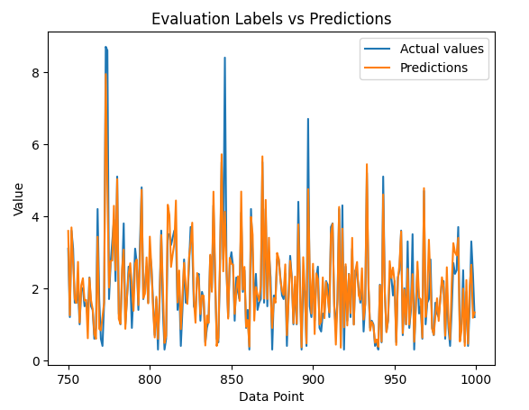

# CO_Prediction

This repository contains a linear regression model made with Python (Python Version 3.10.11) on a Interactive Python Notebook from google colab. The algorithms are implemented using tensorflow v2 and default function definitions provided by [Tensorflow Core](https://www.tensorflow.org/tutorials/estimator/linear?hl=es-419#base_feature_columns).

- [Implementation](src/bayesian_linear_regression.ipynb)
  

## Data source

The dataset used for this personal proyect was provided by FEDESORIANO *(Saverio De Vito (saverio.devito '@' enea.it), ENEA - National Agency for New Technologies, Energy and Sustainable Economic Development)*, details of data collection and meaning of each value are described by FEDESORIANO online at:

* [Dataset Kaggle link](https://www.kaggle.com/datasets/fedesoriano/air-quality-data-set)

---

S. De Vito, E. Massera, M. Piga, L. Martinotto, G. Di Francia, On field calibration of an electronic nose for benzene estimation in an urban pollution monitoring scenario, Sensors and Actuators B: Chemical, Volume 129, Issue 2, 22 February 2008, Pages 750-757, ISSN 0925-4005.
[*article_source*](https://www.sciencedirect.com/science/article/abs/pii/S0925400507007691)

---

"This dataset contains the responses of a gas multisensor device deployed on the field in an Italian city. Hourly responses averages are recorded along with gas concentrations references from a certified analyzer. This dataset was taken from UCI Machine Learning Repository: <https://archive.ics.uci.edu/ml/index.php>"

---

## How to run

This proyect can be readed and tested at:

* [IPYNB GoogleColab](https://colab.research.google.com/drive/1XZnmOy06rqYkKzbkRRvsGDITSye5qZ17?usp=sharing)

By pressing ``CTRL + F9``

Or by cloning the repository and changing the dataset route:

> data_frame = pd.read_csv('**/content/drive/MyDrive**/AirQuality.csv', delimiter=";")

to 

> data_frame = pd.read_csv('**path_to_csv**/AirQuality.csv', delimiter=";")

Also make sure to install all required libraries and the supported Python version before running.
## Questions & Feedback

If you have any questions about the proyect, suggestions or want to spot a mistake, please let me know by creating a new issue or writing me at:

<ALEXANDER.QUESADAQUESADA@ucr.ac.cr>

## License

See the LICENSE file for license rights and limitations (MIT).
